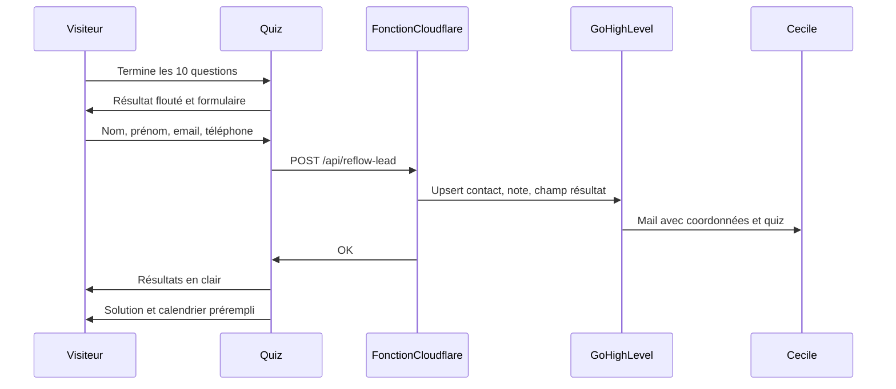

# Funnel du quiz : lead, mail, puis rendez-vous

Dès la fin des 10 questions, la personne voit que son résultat est prêt, mais pas son contenu. Le score, l’interprétation, le détail par dimension et les conseils restent floutés. Pour les obtenir tout de suite, elle laisse nom, prénom, email et téléphone. Ensuite seulement : résultats en clair, solution liée à sa dimension dominante, calendrier de bilan prérempli.

Le mail à Cécile part à ce moment-là, avec l’identité et le quiz. Pas à la fin du quiz seul : il n’y a encore ni nom ni consentement, et un score anonyme n’est pas exploitable.

## Ce que tu fais dans GoHighLevel, avant le code

1. Créer un jeton d’intégration privé avec le droit d’écriture des contacts et des notes. Copier le jeton et le Location ID. Ne pas les coller dans le chat ni dans le repo.
2. Créer un champ personnalisé texte long, par exemple `Résultat quiz`, et noter son identifiant.
3. Créer un workflow : déclencheur « tag ajouté » `quiz-reflow`, action e-mail interne vers `cecile.c.coach@gmail.com`. Le corps du mail reprend nom, prénom, email, téléphone et le champ `Résultat quiz`. Pas de mail automatique à la visiteuse : le calendrier est déjà à l’écran.

## Ce que le code fera

Le site reste statique ([astro.config.mjs](astro.config.mjs)). Nouveau fichier `functions/api/reflow-lead.ts`, route `POST /api/reflow-lead`. Secrets Cloudflare : `GHL_PRIVATE_TOKEN`, `GHL_LOCATION_ID`, `GHL_RESULT_FIELD_ID`.

La fonction :

- n’accepte que le POST, avec un champ honeypot vide ;
- exige nom, prénom, email, téléphone français normalisé en `+33`, consentement, et les 10 réponses (identifiant + points de 0 à 4) ;
- recalcule score, profil et dimension dominante depuis [src/data/reflow.ts](src/data/reflow.ts) ;
- appelle `POST https://services.leadconnectorhq.com/contacts/upsert` (en-tête `Version: 2021-07-28`) avec source `Auto-évaluation RE-FLOW`, tags `quiz-reflow`, `quiz-limite` / `quiz-significatif` / `quiz-important`, et un tag de la dimension dominante ;
- remplit le champ `Résultat quiz` et une note : pourcentage, profil, quatre dimensions, libellé de chaque réponse.

Dans [src/components/ReflowAssessment.astro](src/components/ReflowAssessment.astro), `showResult()` n’affiche plus le score ni ne charge l’iframe. À la place, un écran « Ton résultat est prêt » avec le formulaire (nom, prénom, email, téléphone, case vers la politique de confidentialité). Le contenu déjà prévu (score, jauge, interprétation, conseils aujourd’hui floutés dans `data-rg-profile`, sous-scores) reste masqué.

Après succès :

- ce contenu s’affiche en clair ;
- la solution est le texte déjà écrit pour la dimension dominante (`transitionCopy` dans [src/data/reflow.ts](src/data/reflow.ts)) et le bloc bilan existant ;
- le calendrier se charge prérempli : `https://api.leadconnectorhq.com/widget/booking/dJzUTOt5Rfugql6aVt4K?first_name=…&last_name=…&email=…&phone=…`

Si l’envoi échoue, le résultat reste flouté et le formulaire propose de réessayer. On ne débloque pas sans lead. Événement Umami `lead_submitted` au succès.

Textes à aligner, ils disent encore qu’aucune réponse n’est enregistrée :

- la FAQ dans [src/pages/outils/auto-evaluation-re-flow/index.astro](src/pages/outils/auto-evaluation-re-flow/index.astro) ;
- la politique de confidentialité dans [src/pages/politique-de-confidentialite/index.astro](src/pages/politique-de-confidentialite/index.astro) : consentement, finalité (afficher le résultat, préparer le bilan, mail à Cécile), destinataire GoHighLevel.

## Ce que tu fais dans Cloudflare, après le déploiement du code

Dans le projet Pages `cecilecoaching`, ajouter les trois secrets. En local, `.dev.vars` (ajouté au `.gitignore` s’il n’y est pas) pour `wrangler pages dev`. `astro dev` seul ne sert pas la fonction.

## Vérification

Parcours : quiz, écran flouté sans chiffre, formulaire incomplet refusé, envoi réussi, mail reçu par Cécile avec les réponses, fiche GoHighLevel, résultats affichés, calendrier prérempli. Puis un échec d’envoi : le flou reste en place.

## Reprise sur un autre ordinateur

Ouvrir ce dépôt, faire `git pull`, puis dans un nouveau chat Cursor citer ce fichier : `@.cursor/plans/leads-quiz-gohighlevel.md`. Le code du funnel est écrit. Il reste le réglage GoHighLevel (jeton, champ, workflow) et les trois secrets Cloudflare avant qu’un envoi réel débloque le résultat.
